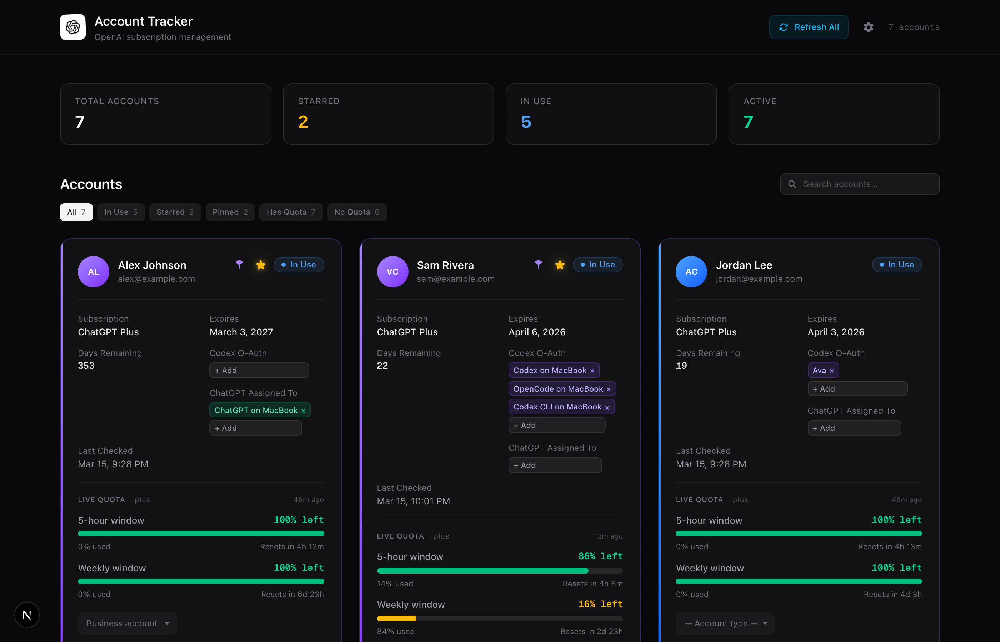
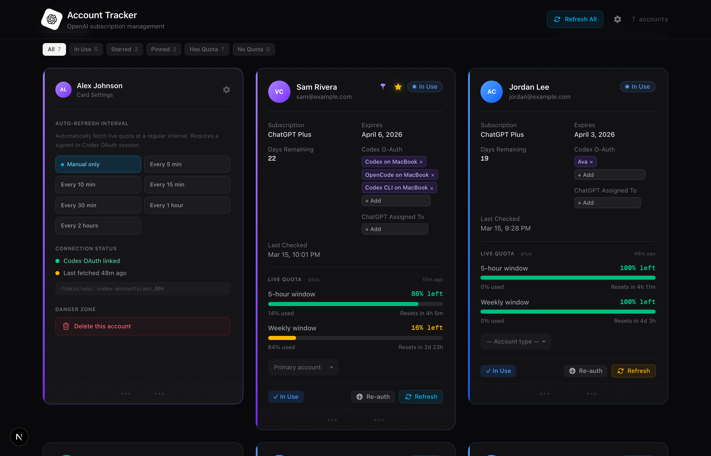

<div align="center">

#  OpenAI Account Tracker

**A local-first dashboard for managing multiple OpenAI accounts.**\
Track subscriptions, live usage quotas, expiration dates, and agent assignments — all from one place.

[](https://github.com/AZLabsAI/OpenAI-Account-Tracker/releases)
[](https://nextjs.org)
[](https://typescriptlang.org)
[](https://sqlite.org)
[](LICENSE)

<br />



<sub>↑ Dashboard view — live quota bars, agent assignments, stale-aware refresh, pin & star controls</sub>

</div>

<br />

## Why This Exists

If you run multiple OpenAI accounts — for personal projects, work, clients, different Codex agents — keeping track of which account is at what usage level is a pain. This app puts everything on one screen with **live data** from the Codex CLI.

> **Local-first, zero telemetry.** Your data lives in a SQLite file on your machine. Nothing is sent anywhere.

<br />

## Features

<table>
<tr>
<td width="50%">

### Core
- **Live quota tracking** — real-time 5-hour & weekly usage via Codex OAuth
- **Auto-refresh** — per-account intervals from 5 min to 2 hours
- **Pin, star, and mark accounts** — organize by priority
- **Search & filter** — by name, email, type, or status
- **Flippable cards** — front shows data, back reveals settings

</td>
<td width="50%">

### Details
- **Custom avatars** — upload your own account logos
- **Stale indicators** — refresh buttons shift blue → amber → orange
- **Account types** — Primary, Personal, Work, Business
- **Agent assignments** — track which Codex/ChatGPT agents use which account
- **Structured logging** — full diagnostics page with color-coded logs

</td>
</tr>
</table>

<br />

## Screenshots

<details>
<summary><strong>Card Settings (flip view)</strong></summary>
<br />

<br />
<sub>Flip any card to access per-account auto-refresh intervals, connection status, and the delete button (tucked away in the Danger Zone).</sub>
</details>

<br />

## Quick Start

```bash
git clone https://github.com/AZLabsAI/OpenAI-Account-Tracker.git
cd OpenAI-Account-Tracker
pnpm install
pnpm dev
```

Open **http://localhost:3000** — that's it.\
Three example accounts are seeded on first run. Add your own or delete the examples.

Use `pnpm lint`, `pnpm typecheck`, and `pnpm test` before pushing changes.

See [CHANGELOG.md](CHANGELOG.md) for release notes.

<br />

## Live Quota Tracking (Optional)

To see real-time usage bars, you need the [Codex CLI](https://github.com/openai/codex) installed:

```bash
# Install Codex CLI (if you haven't)
npm install -g @openai/codex
```

Then click **Sign In** on any card → a browser window opens for OAuth → done.\
The app auto-detects the Codex binary on macOS, Windows, and Linux.

<br />

## Cross-Platform

| | Dashboard | Live Quota |
|---|:---:|:---:|
| **macOS** (ARM / Intel) | Yes | Yes |
| **Windows** (x64) | Yes | Yes |
| **Linux** (x64) | Yes | Yes |

`better-sqlite3` compiles natively on `pnpm install`. Browser OAuth uses the platform-native open command.

<br />

## Deployment

The app is **local-first**: account data lives in SQLite (`data.db`, gitignored) and live quota uses the **Codex CLI** on the host machine. That means a typical production deploy cannot replace your laptop without extra setup (persistent volume, Codex binary, OAuth).

**Vercel** is used for **preview and production UI builds** (feature branches get preview URLs). Full functionality still expects local SQLite + Codex on a machine you control. For multi-device access on your LAN, run `pnpm dev` or `pnpm start` and open `http://<your-ip>:3000`.

<br />

## Architecture

```
src/
├── app/
│   ├── page.tsx                  ← Main dashboard (client component)
│   ├── settings/page.tsx         ← Logs & diagnostics
│   └── api/
│       ├── accounts/             ← CRUD + OAuth login + quota refresh
│       └── logs/                 ← Structured log viewer API
│
├── components/
│   ├── AccountCard.tsx           ← Flippable card (3D CSS transform)
│   ├── AddAccountCard.tsx        ← Modal form for new accounts
│   ├── UsageBar.tsx              ← Quota progress visualisation
│   ├── DashboardStats.tsx        ← Summary stat cards
│   └── StatusBadge.tsx           ← Health indicator pill
│
├── lib/
│   ├── db.ts                     ← SQLite via better-sqlite3
│   ├── logger.ts                 ← Structured logging to SQLite
│   └── codex-appserver.ts        ← Codex CLI JSON-RPC bridge
│
├── data/accounts.ts              ← Seed data + sort/status helpers
└── types/account.ts              ← TypeScript interfaces
```

<br />

## Privacy & Security

| Aspect | Status |
|---|---|
| Account data | Stored in `data.db` locally — **gitignored**, never committed |
| Telemetry | **None** — zero external calls except OpenAI during OAuth |
| API keys | **None** stored in the repo |
| Seed data | Uses only `@example.com` placeholders |
| Network calls | Only to `localhost` and OpenAI auth endpoints |

This dashboard is intended for **trusted environments**. Do not expose the API to the public internet without authentication and hardening.

<br />

## Release Notes

### 0.0.3-beta
- Fixes Codex account-home disk bloat caused by leaked plugin clone temp directories.
- Moves app-server sessions to temporary scratch `CODEX_HOME` directories while keeping account auth persistent.
- Disables unnecessary plugin startup for login/quota sessions.

## Roadmap

- [ ] Export/import accounts (JSON backup)
- [ ] Multi-device sync via CRDTs or file-based replication
- [ ] Account grouping / workspaces
- [ ] Usage history charts (daily/weekly trends)
- [ ] Notification alerts when quota drops below threshold
- [ ] Browser extension for quick-check from any tab

<br />

## Contributing

This project is in **early beta** — contributions welcome!

1. Fork the repo
2. Create a feature branch (`git checkout -b feat/my-feature`)
3. Commit your changes
4. Push and open a Pull Request

Please open an [issue](https://github.com/AZLabsAI/OpenAI-Account-Tracker/issues) first for major changes.

<br />

## License

MIT — see [LICENSE](LICENSE) for details.

<br />

<div align="center">

---

**v0.0.3 Beta** · Made with care by [AZ Labs](https://azlabs.co.za)

<sub>If this is useful, consider giving it a star</sub>

</div>
