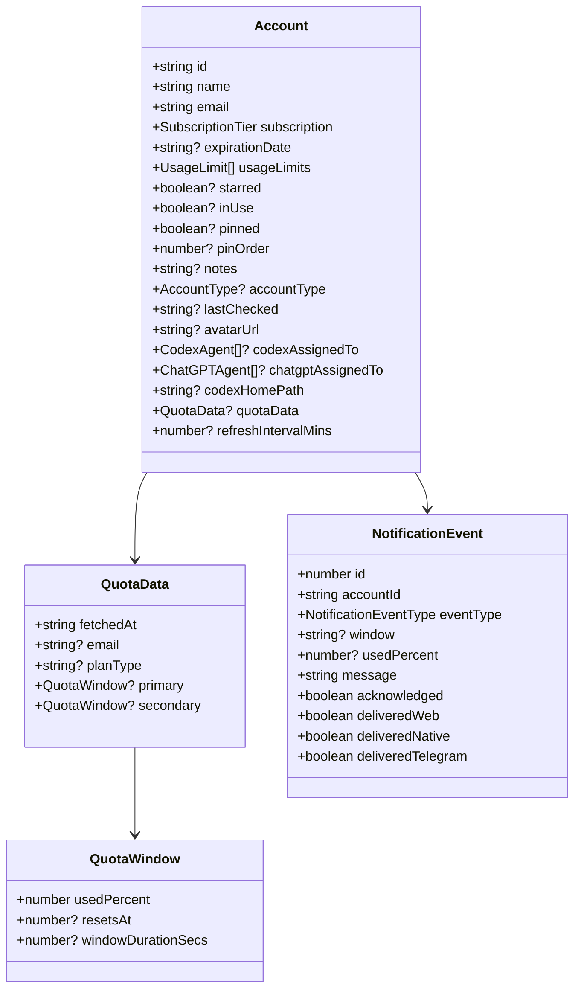
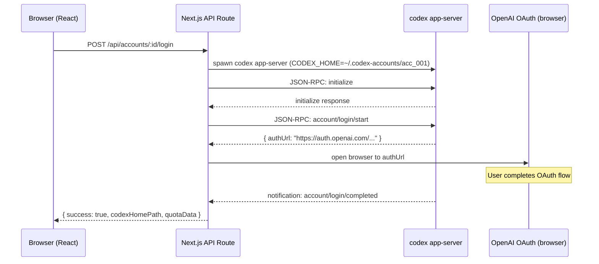
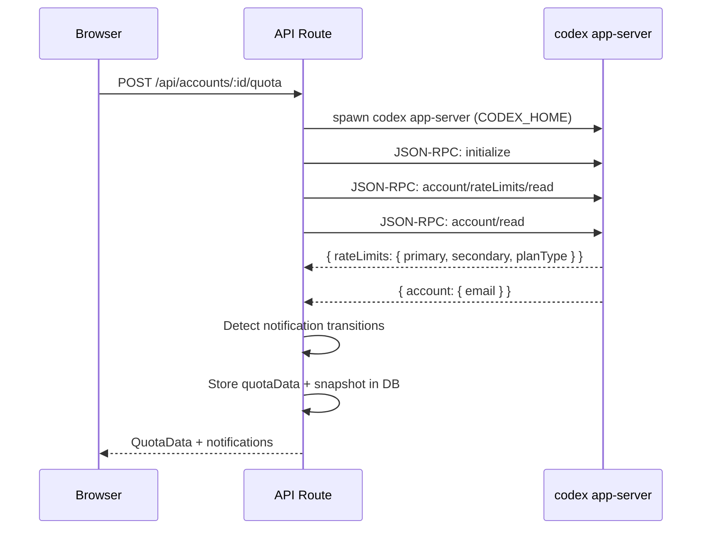
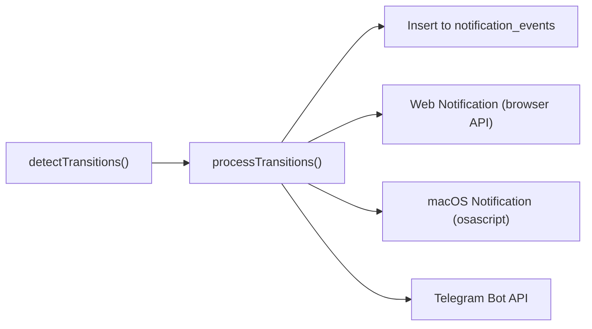

# OpenAI Account Tracker — Complete Codebase Walkthrough

## 1. Purpose & High-Level Overview

**OpenAI Account Tracker** is a self-hosted Next.js dashboard for managing multiple OpenAI/ChatGPT accounts. It solves a real operational problem: when you're running multiple ChatGPT Plus/Pro subscriptions across different machines, agents, and Codex instances, you need a central place to:

- Track which accounts exist, their subscription tiers, and expiration dates
- Monitor **live quota** usage (5-hour and weekly windows) by interfacing with the `codex app-server` binary
- Get **notifications** (Web, native macOS, Telegram) when quota hits warning/critical/exhausted thresholds
- Assign accounts to specific Codex agents and ChatGPT client devices
- Quickly switch between accounts using keyboard shortcuts and a command palette

The app runs locally on `localhost:3000` and stores all data in a SQLite database (`data.db`) at the project root.

---

## 2. Technology Stack

| Layer | Technology |
|---|---|
| Framework | **Next.js 16** (App Router) |
| Language | **TypeScript 5** |
| UI | **React 19** with client components |
| Styling | **Tailwind CSS 4** via PostCSS |
| Database | **SQLite** via `better-sqlite3` (WAL mode) |
| Theme | **next-themes** for dark/light mode |
| Testing | **Vitest 4** (44 tests across 10 files) |
| Linting | **ESLint 9** with `eslint-config-next` |
| Fonts | **Geist Sans** and **Geist Mono** (Google Fonts) |
| Deployment | **Vercel** (preview deployments via PR workflow) |

---

## 3. Project Structure

```
openai-account-tracker/
├── src/
│   ├── app/                    # Next.js App Router
│   │   ├── layout.tsx          # Root layout (theme, toast, fonts)
│   │   ├── page.tsx            # Main dashboard (745 lines)
│   │   ├── globals.css         # Global styles + Tailwind
│   │   ├── settings/page.tsx   # Settings & logs page (massive — 75KB)
│   │   └── api/                # Server-side API routes
│   │       ├── accounts/       # CRUD + quota + login + export/import
│   │       ├── agent-options/  # Codex/ChatGPT agent list management
│   │       ├── logs/           # Structured log viewer + event ingestion
│   │       ├── notifications/  # Notification CRUD + delivery
│   │       └── settings/       # Key-value settings API
│   │
│   ├── components/             # React components
│   │   ├── AccountCard.tsx     # Main card (1036 lines — front/back flip)
│   │   ├── AddAccountCard.tsx  # "Add new account" card
│   │   ├── CommandPalette.tsx  # Cmd+K fuzzy search palette
│   │   ├── DashboardStats.tsx  # Summary statistics (unused currently?)
│   │   ├── KeyboardShortcuts.tsx # `?` overlay, `/` focus, `R` refresh
│   │   ├── NotificationBell.tsx # Header bell with dropdown & filters
│   │   ├── StatusBadge.tsx     # Colored status pill
│   │   ├── ThemeProvider.tsx   # next-themes wrapper
│   │   ├── ThemeToggle.tsx     # Dark/light/system toggle
│   │   ├── Toast.tsx           # Lightweight toast notification system
│   │   ├── UsageBar.tsx        # Quota progress bars (static + live)
│   │   └── index.ts            # Barrel export
│   │
│   ├── hooks/                  # Custom React hooks
│   │   ├── useAccountRefreshController.ts  # Core refresh + auto-refresh logic
│   │   ├── useDocumentTitle.ts # Dynamic tab title with alert indicator
│   │   └── useLiveClock.ts    # Forces re-render every minute
│   │
│   ├── lib/                    # Server-side & shared utilities
│   │   ├── db.ts               # SQLite database layer + migrations
│   │   ├── codex-appserver.ts  # Codex binary JSON-RPC communication
│   │   ├── codex-binary.ts     # Codex binary path resolution (async)
│   │   ├── codex-paths.ts      # Filesystem paths for Codex homes
│   │   ├── account-health.ts   # Quota status + sort rank derivation
│   │   ├── account-accent.ts   # Visual accent color priority
│   │   ├── format-time.ts      # Relative time formatting
│   │   ├── logger.ts           # Structured SQLite logging
│   │   ├── notifications.ts    # Notification engine (detection + delivery)
│   │   ├── notification-presentation.ts # Render helpers for each channel
│   │   ├── notify-native.ts    # macOS native notifications (osascript)
│   │   ├── notify-native-capability.ts  # Native notification capability check
│   │   ├── notify-telegram.ts  # Telegram Bot API delivery
│   │   ├── notify-settings.ts  # Notification settings from DB/env
│   │   └── settings-validation.ts # Settings schema validation
│   │
│   ├── data/
│   │   ├── accounts.ts         # Seed data + `getSortedAccounts` sort
│   │   └── accounts.test.ts    # Sort order tests
│   │
│   └── types/
│       ├── account.ts          # All TypeScript types & enums
│       └── index.ts            # Re-export
│
├── data.db                     # SQLite database (gitignored runtime data)
├── package.json                # v0.0.3-beta
├── vitest.config.ts            # Test config
└── AGENTS.md                   # Agent memory file
```

---

## 4. Data Model

### 4.1 Core Types (account.ts)



**Key enums:**
- `SubscriptionTier`: Free, ChatGPT Plus, ChatGPT Pro, ChatGPT Team, Enterprise, API Pay-As-You-Go, API Scale
- `QuotaStatus`: normal, weekly-warning, waiting-refresh
- `AccountStatus`: in-use, active, waiting-refresh, expiring-soon, expired, unknown
- `NotificationEventType`: quota_warning, quota_critical, quota_exhausted, quota_reset, account_switch

### 4.2 Agent/Machine assignments

Each account can be assigned to multiple machines:
- **Codex agents**: Eve, Ava, Codex on MacBook, Codex CLI on Work-PC, OpenCode on MacBook, Pi Agent on MacBook, etc.
- **ChatGPT agents**: ChatGPT on MacBook, ChatGPT on iPhone, ChatGPT on Work-PC

These are stored as JSON arrays in the DB and are user-customizable (new options can be added inline).

---

## 5. Database Layer (db.ts)

### 5.1 Architecture

- **Engine**: SQLite via `better-sqlite3` in WAL mode for concurrent reads
- **Location**: `data.db` at project root
- **Singleton**: `getDb()` lazily initializes the connection once

### 5.2 Schema (9 migrations)

| Version | Migration |
|---|---|
| 1 | Create `accounts` table with all core columns |
| 2 | Add `pinned` and `pinOrder` columns |
| 3 | Add `codexHomePath` column (live Codex OAuth link) |
| 4 | Add `quotaData` column (JSON blob for live quota) |
| 5 | Add `refreshIntervalMins` column |
| 6 | Rebuild table to make `expirationDate` nullable |
| 7 | Create `settings` key-value table |
| 8 | Create `notification_events` table |
| 9 | Create `quota_history` table for sparkline data |

Migrations run transactionally and track version in a `schema_meta` table.

### 5.3 Additional tables

- **`logs`** — Created by `logger.ts` (not via migration). Structured log entries with auto-prune at 2000 rows.
- **`settings`** — Generic key-value store for notification config, Telegram creds, etc.
- **`notification_events`** — Full notification history with per-channel delivery tracking.
- **`quota_history`** — Time-series snapshots (accountId, fetchedAt, primaryPct, weeklyPct) for sparklines.

### 5.4 Key operations

- **`getAllAccounts()`** / **`getAccount(id)`**: Deserializes JSON columns (usageLimits, codexAssignedTo, quotaData, etc.)
- **`updateAccount(id, patch)`**: Dynamic SQL builder — only touches fields present in the patch
- **`createAccount(data)`**: Generates `acc_{timestamp}_{random}` IDs
- **Seed on first run**: If `accounts` table is empty, seeds from `data/accounts.ts`

---

## 6. Codex Integration — Live Quota Tracking

This is the most architecturally interesting part. The app communicates with the **`codex app-server`** binary via **stdin/stdout JSON-RPC**.

### 6.1 Flow: How an account gets connected



### 6.2 Flow: Quota refresh



### 6.3 Isolated CODEX_HOME directories

Each account gets its own `~/.codex-accounts/acc_XXX/` directory containing its own `auth.json`. This allows multiple accounts to be logged in simultaneously without conflicting with the default `~/.codex` directory.

### 6.4 codex-appserver.ts

Key design decisions:
- Uses `AsyncGenerator<RpcMessage>` + `.next()` (NOT `for-await-of`) to avoid closing the generator prematurely
- 15-second timeout on quota fetches, 5-minute timeout on login
- Captures stderr for debugging but ignores non-JSON output
- Always kills the subprocess in `finally` blocks

---

## 7. Notification Engine (notifications.ts)

### 7.1 Threshold detection

Thresholds are defined as **remaining percentages**: `[15%, 10%, 5%, 0%]`

**`detectTransitions(account, oldQuota, newQuota)`** compares old vs new quota for each window (primary/secondary) and fires:

| Remaining | Event Type | Emoji |
|---|---|---|
| ≤ 15% | `quota_warning` | ⚠️ |
| ≤ 5% | `quota_critical` | 🔴 |
| 0% (depleted) | `quota_exhausted` | 🚨 |
| High→Low reset | `quota_reset` | ✅ |

Rules:
- Only fires the **highest severity** threshold per window
- **Deduplication**: Won't re-fire if there's an unresolved event of the same type (no reset since the last one)
- **Exhausted reminders**: Configurable re-notification interval after depletion
- **Reset detection**: If `usedPercent` drops from ≥90% to <50%, it's a quota reset

### 7.2 Multi-channel delivery



- **Web notifications**: Fired client-side via the `Notification` browser API; the server returns notification previews
- **Native macOS**: Uses `osascript` or `terminal-notifier` to show native alerts  
- **Telegram**: HTTP POST to `https://api.telegram.org/bot{token}/sendMessage` with retry logic
- **Quiet hours**: Configurable; events are recorded but not delivered during quiet hours

### 7.3 Additional notification types

- **`account_switch`**: Fired when the active Codex session (via `~/.codex/auth.json`) switches to a different account

---

## 8. React UI Architecture

### 8.1 Main Page (page.tsx)

The main page is a **single client component** (`"use client"`) that orchestrates:

1. **Data loading**: Fetches accounts from `/api/accounts` + agent options on mount
2. **Sorting**: `getSortedAccounts()` — health rank → pinned (by pinOrder) → starred → alphabetical
3. **Filtering**: 7 filter pills (All, In Use, Not In Use, Starred, Pinned, Has Quota, No Quota)
4. **Search**: Fuzzy match on name, email, accountType, subscription
5. **Refresh controller**: Via `useAccountRefreshController` hook

**State management**: Pure `useState` + `useCallback` — no external state library. All mutations optimistically update local state and fire `PATCH` requests to persist.

### 8.2 Account Card (AccountCard.tsx)

The card is the largest component (1036 lines) with a **3D flip animation**:

**Front face:**
- Avatar (uploadable via click) with accent color ring based on pin/star/inUse status
- Name + email (click-to-copy)  
- Pin, Star, and StatusBadge icons in the top-right
- 2-column details grid: Subscription, Expiry, Days Remaining, Codex OAuth assignments, ChatGPT assignments, Last Checked
- Static usage limits OR live quota bars (mutually exclusive)
- Action bar: Mark In Use, Sign In, Refresh Quota
- "Settings" flip trigger at the bottom

**Back face (settings):**
- Editable account name
- Auto-refresh interval selector (Manual, 5min, 10min, 15min, 30min, 1h, 2h)
- Connection status (OAuth linked, last fetched, codexHomePath)
- Assignment management with inline agent adding
- Notes textarea
- Delete button with confirmation dialog

**Visual details:**
- Border color changes based on priority: expiry urgency > pinned (violet) > starred (amber) > inUse (blue) > default
- Accent strip at the top of the card (thin colored bar)
- Exit animation on delete (`animate-card-exit`)

### 8.3 Drag-to-Reorder

Pinned cards can be **dragged to rearrange their pin order**:
- Uses native HTML5 drag-and-drop (`draggable`, `onDragStart`, `onDragOver`, `onDrop`)
- Recomputes `pinOrder` for all pinned cards on drop
- Persists new order via `PATCH` API

### 8.4 Command Palette (CommandPalette.tsx)

- Activated via **Cmd+K** (or Ctrl+K)
- Fuzzy search across account name, email, and accountType
- Results include quick actions: refresh, star/unstar, pin/unpin
- Keyboard navigation with arrow keys + Enter

### 8.5 Keyboard Shortcuts (KeyboardShortcuts.tsx)

| Key | Action |
|---|---|
| `?` | Toggle shortcuts help overlay |
| `/` | Focus search input |
| `R` | Refresh all accounts |
| `Cmd+K` | Open command palette |

### 8.6 Notification Bell (NotificationBell.tsx)

- Shows unread count badge
- Polls `/api/notifications` every 15 seconds
- Dropdown with filters: severity type, delivery channel, unread-only toggle
- Mark all as read action
- Links to settings page for notification configuration

---

## 9. Auto-Refresh System (useAccountRefreshController.ts)

This hook manages all refresh logic:

### 9.1 Manual refresh
- `refreshAccount(id)`: POSTs to `/api/accounts/:id/quota`, applies the returned QuotaData, fires web notifications

### 9.2 Refresh All
- `refreshAll()`: Iterates accounts **in display sort order** (matching what the user sees on screen), sequentially refreshing each one
- Shows progress indicator: "3/7 Refreshing…"
- Logs timing and success/failure counts

### 9.3 Auto-refresh
- Runs a 30-second interval that checks each account's effective refresh interval
- `getEffectiveRefreshIntervalMins()` considers:
  1. The user's configured `refreshIntervalMins` (e.g., 5 min)
  2. Recovery watch: if quota is depleted, polls every 15 min; if reset is within 10 min, polls every 1 min

### 9.4 "In Use" auto-refresh
When an account is marked as "In Use":
- `refreshIntervalMins` is automatically set to 5 minutes
- A brief toast/notice appears: "Auto-refresh set to every 5 min"

### 9.5 Request deduplication
- Tracks in-flight requests per account in `inflightRefreshesRef`
- Uses `requestIdsRef` to handle stale responses (if two requests race, only the latest one applies)

---

## 10. Account Health & Sort Logic

### 10.1 Health derivation (account-health.ts)

```
QuotaStatus:
  - "waiting-refresh" if primary or secondary usedPercent ≥ 100%
  - "weekly-warning" if secondary usedPercent ≥ 95%
  - "normal" otherwise

SubscriptionStatus:
  - "expired" if past expiration
  - "expiring" if ≤ 5 days remaining
  - "active" otherwise

AccountStatus (composite):
  - "waiting-refresh" > "in-use" > "expiring-soon" > "expired" > "active"
```

### 10.2 Sort order (accounts.ts)

```
1. Health rank (waiting-refresh=2 > weekly-warning=1 > healthy=0)
2. Pinned accounts (by pinOrder, ascending)
3. Starred accounts
4. Alphabetical by name
```

This ensures critical accounts (depleted quota) always surface to the top.

---

## 11. API Routes

### 11.1 Account CRUD

| Method | Route | Purpose |
|---|---|---|
| GET | `/api/accounts` | List all accounts |
| POST | `/api/accounts` | Create new account |
| GET | `/api/accounts/[id]` | Get single account |
| PATCH | `/api/accounts/[id]` | Update account fields |
| DELETE | `/api/accounts/[id]` | Delete account |

### 11.2 Live Quota

| Method | Route | Purpose |
|---|---|---|
| POST | `/api/accounts/[id]/login` | Start OAuth flow via Codex app-server |
| POST | `/api/accounts/[id]/quota` | Fetch live quota from Codex app-server |
| GET | `/api/accounts/[id]/history` | Get quota history for sparklines |

### 11.3 Bulk Operations

| Method | Route | Purpose |
|---|---|---|
| GET | `/api/accounts/export` | Export all accounts as JSON |
| POST | `/api/accounts/import` | Import accounts from JSON |
| GET | `/api/accounts/active-codex` | Detect which account is active in `~/.codex/auth.json` |

### 11.4 Other

| Method | Route | Purpose |
|---|---|---|
| GET/PATCH | `/api/agent-options` | Manage Codex/ChatGPT agent dropdown lists |
| GET/PATCH | `/api/notifications` | List/acknowledge notification events |
| GET/PATCH | `/api/settings` | Read/write notification & Telegram settings |
| POST | `/api/logs/event` | Client-side log ingestion |
| GET | `/api/logs` | Query structured logs |

---

## 12. Structured Logging (logger.ts)

- All server-side actions log to the `logs` SQLite table
- **Categories**: system, notification, quota, login, account, refresh-all
- **Levels**: info, success, warn, error
- Each entry can include: accountId, accountEmail, detail (JSON), durationMs
- Auto-prunes to 2000 entries
- `getNotificationChannelHealth()` derives per-channel health (last attempt/success/failure) from log entries
- Viewable in the Settings page with filtering by level, category, and search

---

## 13. Supporting Utilities

### 13.1 account-accent.ts
Priority: waiting-refresh (red) > pinned (violet) > starred (amber) > inUse (blue) > default (zinc). Used for both the card accent strip and avatar ring.

### 13.2 format-time.ts
Relative time formatting: `formatLastFetchedAgo("2026-04-06T01:30:00Z")` → `"15m ago"`. Also `formatQuotaFetchedLabel()` for the quota bar header.

### 13.3 codex-paths.ts
Resolves the Codex binary across Mac ARM, Mac Intel, Linux, and Windows. Tries well-known paths first, falls back to `which`/`where`.

### 13.4 settings-validation.ts
Validates settings payloads: notification toggles, Telegram credentials, quiet hours ranges, threshold arrays.

---

## 14. Testing

44 tests across 10 test files, all using Vitest:

| File | Tests | What it covers |
|---|---|---|
| `accounts.test.ts` | Sort order | `getSortedAccounts` priority |
| `account-accent.test.ts` | Accent selection | Visual priority order |
| `account-health.test.ts` | Health derivation | Quota status, subscription status |
| `format-time.test.ts` | Time formatting | Relative time strings |
| `codex-paths.test.ts` | Binary resolution | Platform-specific path lookup |
| `notifications.test.ts` | Transition detection | Threshold crossings, resets, dedup |
| `notification-presentation.test.ts` | Rendering | Message formatting per channel |
| `notify-telegram.test.ts` | Telegram delivery | HTTP API integration |
| `settings-validation.test.ts` | Validation | Settings payload validation |
| `useAccountRefreshController.test.ts` | Refresh logic | Auto-refresh interval computation |

Run with: `pnpm test`

---

## 15. Deployment & Git Workflow

- **Deployed on Vercel** — every PR creates a preview deployment
- **Never push directly to `main`** — always feature branch → PR → squash merge + delete branch
- **Branch naming**: `feat/`, `fix/`, `chore/` prefixes
- **Version**: `0.0.3-beta` (displayed in the footer)
- **GitHub**: `AZLabsAI/OpenAI-Account-Tracker`

---

## 16. Key Architectural Patterns

### Pattern: Optimistic UI + Fire-and-Forget Persistence
All mutations (star, pin, inUse, assignments, etc.) immediately update React state and fire a background `PATCH` to `/api/accounts/:id` with `keepalive: true`. This gives instant UI feedback while persisting asynchronously.

### Pattern: JSON-in-SQLite
Complex nested data (usageLimits, codexAssignedTo, quotaData) is stored as JSON text columns. `rowToAccount()` deserializes on read, mutations serialize on write. This avoids join complexity for data that's always read as a unit.

### Pattern: AsyncGenerator for JSON-RPC
The Codex app-server communicates via stdin/stdout newline-delimited JSON. The code uses an `AsyncGenerator` to iterate incoming messages, carefully using `.next()` instead of `for-await-of` to avoid closing the generator prematurely (a subtle but critical design choice).

### Pattern: Multi-layer Notification Dedup
Notifications are deduplicated at three levels:
1. **DB-level**: `hasUnresolvedEvent()` prevents re-firing until a `quota_reset` clears the state
2. **Quiet hours**: Events are recorded but not delivered
3. **Client-side**: Web notifications use `tag` to collapse duplicate browser toasts

### Pattern: Recovery Watch
When quota is depleted, the auto-refresh system tightens its polling interval:
- Normal: user-configured interval (e.g., 5 min)
- Depleted: every 15 minutes
- Near reset (within 10 min): every 1 minute

This ensures the user is notified the moment quota recovers without excessive polling.
